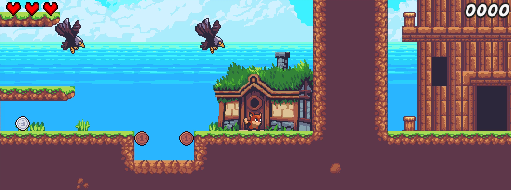
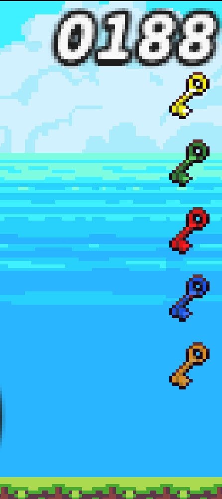
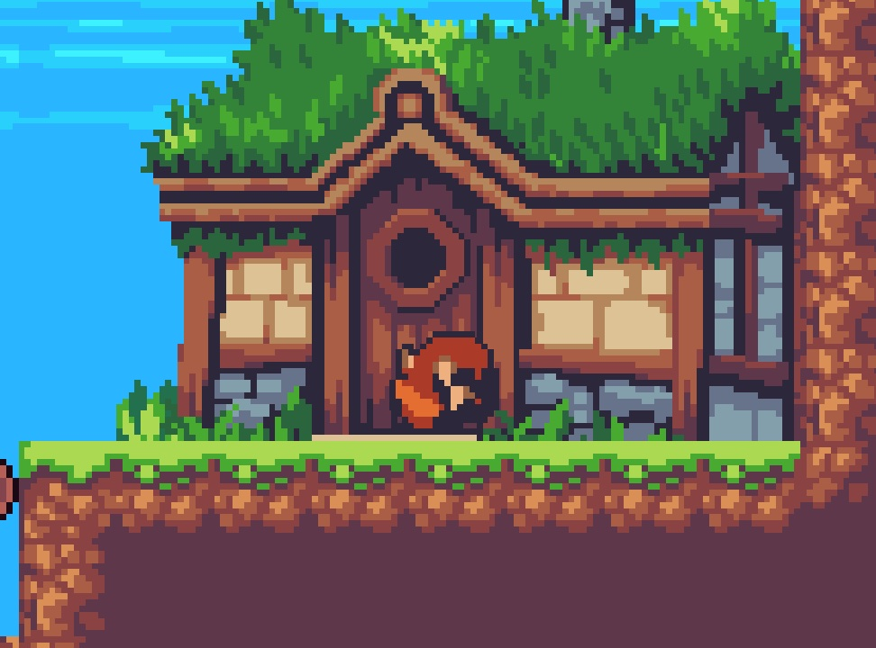
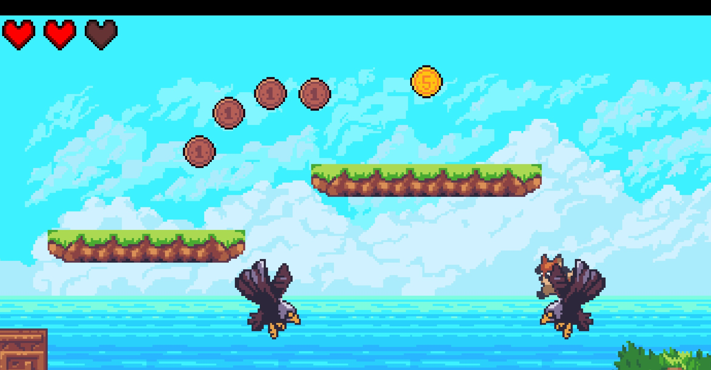
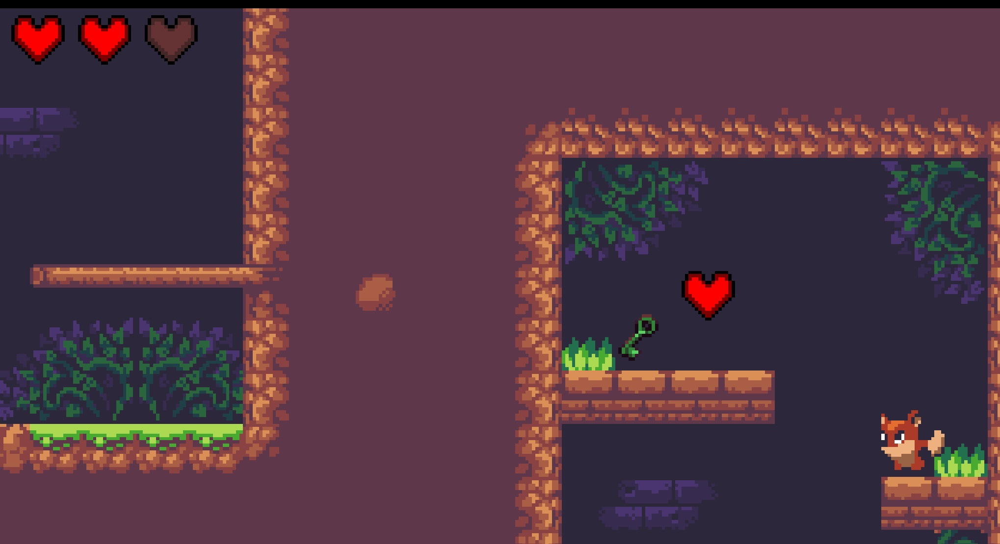
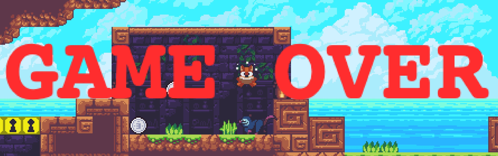
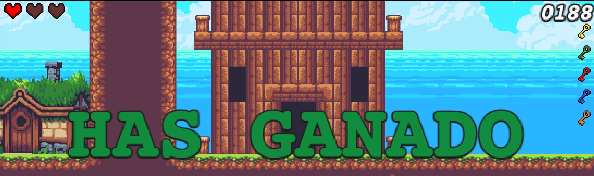

# Memoria del proyecto — Las aventuras de FoxRoll

**Asignatura:** Videojuegos para la web
**Integrantes del grupo:** Víctor González, Carlos Díez, Aike Fernández, Kevin Peciña
**URL del juego publicado:** [PENDIENTE — añadir cuando se publique en GitHub Pages]
**Repositorio:** [URL del repositorio]
**Vídeo de gameplay:** [opcional — URL de YouTube/Drive]

---

## 1. Introducción

**Las aventuras de FoxRoll** es un videojuego de plataformas 2D desarrollado con
la librería **Phaser 3** (versión 3.90.0) como parte de la actividad grupal de
la asignatura **Videojuegos para la web**. El jugador controla a **Foxy**, un pequeño
zorro que debe recorrer un nivel basado en *tilemap*, recoger las llaves de
colores repartidas por el mapa para desbloquear los muros del mismo color,
derrotar o esquivar a los enemigos (zarigüeyas, ranas y águilas) y recoger
corazones para mantener la vida.

El proyecto se ha construido íntegramente con tecnologías web (HTML5, JavaScript
modular ES6 y CSS), lo que permite su ejecución directa en cualquier navegador
moderno sin necesidad de instalación.

### Objetivos del juego

- Recoger las llaves de colores repartidas por el mapa para desbloquear los
  muros del mismo color.
- Esquivar o derrotar a los enemigos mediante el ataque de embestida (*roll*)
  o pisándolos desde arriba.
- Recoger corazones para mantener la vida durante el recorrido.

---

## 2. Cómo jugar

| Acción           | Tecla(s)                |
|------------------|-------------------------|
| Moverse          | `A` / `D` o `←` / `→`   |
| Saltar           | `W`, `Espacio` o `↑`    |
| Atacar (roll)    | `S` o `↓`               |
| (Debug) Daño     | `H`                     |

**Mecánicas principales:**

1. **Movimiento horizontal** con velocidad constante (`velocidad = 180`).
2. **Salto** solo cuando el personaje está apoyado en el suelo
   (`onFloor()`), velocidad inicial `-380`.
3. **Ataque tipo *roll***: al pulsar la tecla de ataque, Foxy se impulsa hacia
   delante a `280 px/s` durante `400 ms` y activa una *hitbox* invisible que
   daña a los enemigos. *Cooldown* de `500 ms` entre ataques. Durante el roll
   el jugador no puede moverse manualmente (le da sensación de peso).
4. **Sistema de vida (3 corazones)**: el jugador empieza con 3 puntos. Al
   recibir daño parpadea, queda invulnerable durante 1 segundo y recibe un
   *knockback* en sentido contrario al de la fuente. El HUD muestra los 3
   corazones como llenos o vacíos según la vida actual. Al llegar a 0 se
   muestra *GAME OVER*.
5. **Corazones recolectables**: el mapa contiene corazones que, al recogerlos,
   suman 1 punto de vida hasta el máximo de 3. Si la vida ya está al máximo,
   el corazón no se recoge.
6. **Llaves y muros desbloqueables**: hay 5 muros de colores (amarillo, verde,
   rojo, azul y naranja) y 5 llaves del mismo color en el mapa. Al recoger
   una llave se destruye el muro correspondiente y aparece su icono en el HUD.
7. **Combate contra enemigos**: el jugador puede derrotarlos de dos formas
   (ver `checkAgainstEnemies` en la escena):
   - **Pisándolos** desde arriba (cayendo sobre ellos) → rebote vertical
     automático estilo Mario.
   - **Atacando con roll** mientras los toca.
   Si el contacto no cumple ninguna de las dos condiciones, el jugador
   recibe 1 punto de daño y suena el SFX de daño.
8. **Audio**: música de fondo en bucle y SFX de ataque/daño.
9. **Final del nivel**: el nivel se completa cuando el jugador llega a la
   **torre final** y entra en ella (pulsando la tecla de salto frente a la
   puerta). En ese momento se dispara el evento `finaliza-nivel` y se muestra
   la pantalla de victoria.

---

## 3. Elementos que componen el juego

### 3.1 Estructura de directorios

```
actividad3-juegosweb.github.io/
├── index.html                  # punto de entrada (carga main2.js)
├── assets/
│   ├── map.json                # tilemap principal (Tiled)
│   ├── tileset.png             # tileset principal del nivel
│   ├── tileset.json            # metadatos del tileset
│   ├── back.png                # tileset del fondo (parallax fijo)
│   ├── house.png               # tileset de las casas/estructuras
│   ├── atlas.png               # atlas de enemigos (opossum, frog, eagle, death)
│   ├── atlas.json              # metadatos del atlas de enemigos
│   ├── audio/
│   │   ├── musica.mp3          # música de fondo en loop
│   │   ├── sonido-dano.mp3     # SFX cuando el jugador recibe daño
│   │   ├── sonido-explosion.mp3# SFX cuando muere un enemigo
│   │   └── sonido-moneda.mp3   # SFX al recoger moneda
│   ├── icons/                  # iconos del HUD
│   │   ├── heartFull.png       # corazón lleno (vida actual)
│   │   ├── heartEmpty.png      # corazón vacío (vida perdida)
│   │   ├── keyYellow/Green/Red/Blue.png, orangeKey.png
│   │   └── coinGold/Silver/Bronze.png
│   └── sunny/                  # paquete gráfico Sunny Land (ansimuz, CC0)
│       ├── Characters/Foxy/Sprites/    # frames del protagonista
│       └── environment/, Misc/         # tilesets y FX adicionales del pack
└── scripts/
    ├── main2.js                # configuración de Phaser y arranque
    ├── escenaBase2.js          # escena principal del juego (única)
    ├── player.js               # clase Player (Foxy)
    ├── life.js                 # clase Corazon (coleccionable de vida)
    ├── enemies/
    │   ├── Opossum.js          # enemigo terrestre que patrulla
    │   ├── Frog.js             # enemigo que salta sincronizado
    │   └── Eagle.js            # enemigo aéreo con tween vertical
    └── objects/
        ├── llave.js            # clase Llave (coleccionable)
        ├── keyType.js          # enum de colores de llave
        ├── moneda.js           # clase Moneda (coleccionable)
        └── coinType.js         # enum/valores de moneda
```

### 3.2 Inventario de clases

| Clase           | Fichero                  | Hereda de                       | Descripción |
|-----------------|--------------------------|---------------------------------|-------------|
| `EscenaBase`    | `escenaBase2.js`         | `Phaser.Scene`                  | Escena principal del juego: carga assets, monta el tilemap (múltiples capas), instancia al jugador, enemigos, llaves y corazones, gestiona colisiones, HUD, música y eventos. |
| `Player`        | `player.js`              | `Phaser.Physics.Arcade.Sprite`  | Personaje principal (Foxy). Gestiona movimiento, salto, ataque tipo *roll*, sistema de daño con invulnerabilidad, curación y muerte. Se comunica con la escena por eventos. |
| `Corazon`       | `life.js`                | `Phaser.Physics.Arcade.Sprite`  | Coleccionable de vida. Sin gravedad. Recoge → llama a `player.curar(1)` (con tope a `vidaMax`). |
| `Llave`         | `objects/llave.js`       | `Phaser.Physics.Arcade.Sprite`  | Coleccionable. Atributo `tipo` (valor de `KeyType`). Al recogerla, desbloquea el muro del mismo color. |
| `KeyType`       | `objects/keyType.js`     | *(objeto enum)*                 | Enum de colores: `Yellow`, `Green`, `Red`, `Blue`, `Orange`. |
| `Moneda`        | `objects/moneda.js`      | `Phaser.Physics.Arcade.Sprite`  | Coleccionable de puntos. Sin gravedad. |
| `Opossum`       | `enemies/Opossum.js`     | `Phaser.Physics.Arcade.Sprite`  | Enemigo terrestre que patrulla horizontalmente, rebota al chocar y se voltea según la dirección. |
| `Frog`          | `enemies/Frog.js`        | `Phaser.Physics.Arcade.Sprite`  | Enemigo que da saltos sincronizados con un temporizador global (`frogJumpSide`) de la escena. |
| `Eagle`         | `enemies/Eagle.js`       | `Phaser.Physics.Arcade.Sprite`  | Enemigo aéreo sin gravedad. Se mueve verticalmente con un tween *yoyo* y mira hacia el jugador. |

### 3.3 Inventario de assets

| Asset                                  | Origen / autoría                                            | Uso |
|----------------------------------------|-------------------------------------------------------------|-----|
| `assets/sunny/Characters/Foxy/`        | **Sunny Land** — *ansimuz* (CC0 1.0 Universal)              | Sprites del protagonista (idle, run, jump, hurt, Roll). |
| `assets/sunny/environment/`            | Sunny Land — *ansimuz* (CC0 1.0)                            | Tilesets y props decorativos del pack. |
| `assets/sunny/Misc/`                   | Sunny Land — *ansimuz* (CC0 1.0)                            | Efectos visuales e ítems extra del pack. |
| `assets/tileset.png`, `assets/back.png`, `assets/house.png` | Adaptados de Sunny Land — *ansimuz* (CC0 1.0)               | Tilesets usados por el mapa principal. |
| `assets/map.json`                      | Elaboración propia con **Tiled**                            | Tilemap del nivel jugable. |
| `assets/atlas.png` + `assets/atlas.json` | Sunny Land — *ansimuz* (CC0 1.0), montado como atlas        | Sprites y animaciones de enemigos (opossum, frog, eagle) y FX de muerte. |
| `assets/icons/heartFull.png`, `heartEmpty.png` | Material de la asignatura                                 | HUD de vida y coleccionable de corazón. |
| `assets/icons/keyYellow/Green/Red/Blue.png`, `orangeKey.png` | Material de la asignatura                                 | Llaves coleccionables y HUD. |
| `assets/icons/coinGold/Silver/Bronze.png` | Material de la asignatura                                | Monedas coleccionables. |
| `assets/audio/musica.mp3`              | [PENDIENTE — indicar autoría/licencia]                      | Música de fondo en loop. |
| `assets/audio/sonido-dano.mp3`, `sonido-explosion.mp3`, `sonido-moneda.mp3` | [PENDIENTE — indicar autoría/licencia]                      | Efectos de sonido. |
| `phaser.min.js` (CDN)                  | Phaser Studio — licencia MIT                                | Motor del juego. |

> **Nota sobre licencias:**
> El pack gráfico **Sunny Land**, obra de *ansimuz*, se distribuye bajo
> licencia **Creative Commons Zero v1.0 Universal (CC0 1.0)**. Esta licencia
> equivale a dominio público: permite **usar, modificar, redistribuir e
> incluso explotar comercialmente la obra sin necesidad de atribución**
> (*“No Rights Reserved”*). Aun así, como buena práctica académica, en este
> trabajo se acredita expresamente al autor en este apartado y en la
> webgrafía (sección 9).
>
> El motor **Phaser 3** se distribuye bajo licencia **MIT** (uso, copia y
> modificación libres conservando el aviso de copyright). No se han
> incorporado en el proyecto recursos protegidos por derechos de autor.

---

## 4. Descripción del código relevante

### 4.1 Arranque y configuración (`main2.js`)

Configura una instancia de `Phaser.Game` con `Phaser.AUTO` (selecciona WebGL
o Canvas automáticamente), modo de escalado `FIT`, canvas lógico de
`2200×1000`. Activa la física *Arcade* con gravedad vertical `500` y modo
`pixelArt: true` (filtros nearest-neighbor) para que los sprites pixel art
se vean nítidos al escalar.

```js
const config = {
    type: Phaser.AUTO,
    scale: { mode: Phaser.Scale.FIT, width: 2200, height: 1000, ... },
    backgroundColor: '#87cfeb',
    scene: EscenaBase,
    physics: { default: 'arcade', arcade: { gravity: { y: 500 }, fps: 60 } },
    render: { pixelArt: true, antialias: false, roundPixels: true }
};
new Phaser.Game(config);
```

### 4.2 Escena principal (`escenaBase2.js`)

Es la única escena del juego y orquesta todos los sistemas. Estructura:

- **`preload()`**: carga el tilemap (`map.json`), los tres tilesets
  (`tileset.png`, `back.png`, `house.png`), los iconos del HUD (llaves y
  corazones), los frames sueltos de Foxy (idle, run, jump, hurt, Roll), el
  atlas de enemigos (`atlas.png` + `atlas.json`) y los tres ficheros de
  audio (música, daño y explosión).

- **`create()`**:
  1. Monta el tilemap con varias capas: `background_fixed`, `background`,
     `solid` (suelo principal), `platforms` (atravesables por abajo),
     `foreground`, `casa`, y las 5 capas de muros desbloqueables
     (`yellowLock`, `greenLock`, `redLock`, `blueLock`, `orangeLock`).
  2. Inicializa la música de fondo en bucle (`musica-fondo`).
  3. Instancia al `Player` en `(850, 390)` y configura sus *colliders* contra
     `solid` y contra los 5 muros. Las `platforms` usan un *processCallback*
     que solo permite colisión cuando el jugador cae (`velocity.y >= 0`).
  4. Crea las animaciones de enemigos a partir del atlas
     (`crearAnimacionesEnemigos`).
  5. Crea el grupo `enemies`, sus colisiones con `solid`/`platforms` y el
     *overlap* `checkAgainstEnemies` entre jugador y enemigos.
  6. Lanza un `time.addEvent` periódico (cada 2 s) que alterna
     `this.frogJumpSide` entre `'left'` y `'right'`, sincronizando los
     saltos de todas las ranas.
  7. *Spawnea* enemigos (`Opossum`, `Frog`, `Eagle`) en posiciones fijas
     repartidas en dos zonas del nivel.
  8. Recorre las *object layers* de Tiled (`yellowKey`, `greenKey`, `redKey`,
     `blueKey`, `orangeKey`) e instancia una `Llave` por objeto con su
     *collider* contra `solid` y contra el jugador (`cogeLlave`).
  9. Crea el grupo de corazones (`Corazon`), sus *colliders* y el *overlap*
     con el jugador para curación.
  10. Construye el HUD: marcador de monedas (texto), 3 corazones e
      huecos para las 5 llaves.
  11. Se suscribe a los eventos del jugador (`jugador-vida-cambio`,
      `jugador-muerto`) para actualizar HUD y mostrar *GAME OVER*.

- **`cogeLlave(llave, jugador)`**: destruye la llave, destruye el *collider*
  y la capa de muro del color correspondiente, y muestra el icono de esa
  llave en el HUD.

- **`checkAgainstEnemies(player, enemy)`**: decide si el jugador ataca o
  recibe daño. Considera "ataque desde arriba" cuando el jugador está sobre
  el enemigo y cae con velocidad positiva, y "ataque con roll" cuando
  `player.atacando === true`. Si ataca: reproduce la animación
  `enemy_dead`, el sonido `enemy-dead-sound`, destruye al enemigo y rebota
  al jugador si vino desde arriba. Si no: `player.recibirDano(1, enemy.x)`
  y reproduce `hurt-sound`.

### 4.3 Enemigos (`scripts/enemies/`)

Los tres tipos comparten que heredan de `Phaser.Physics.Arcade.Sprite` y
exponen un `update()` que la escena invoca por iteración sobre el grupo
`enemies`.

- **`Opossum`**: enemigo terrestre. Patrulla horizontalmente con
  `velocity.x = ±100` y `setBounce(1, 0)`, lo que hace que rebote al chocar
  con un muro. Se voltea con `flipX` según la dirección de la velocidad.
- **`Frog`**: enemigo que salta sincronizado. Lee la variable global de la
  escena `frogJumpSide` (alternada cada 2 s) y, cuando cambia, da un salto
  hacia el nuevo lado (`velocityY = -370`, `velocityX = ±90`). En el suelo
  se detiene. Cambia de frame manualmente según suba o baje (`frog-jump-1`
  o `frog-jump-2`).
- **`Eagle`**: enemigo aéreo sin gravedad. Mantiene un movimiento vertical
  constante con un `tween` *yoyo* de 1500 ms. En `update()` mira hacia el
  jugador (`flipX = this.x <= scene.player.x`).

### 4.3 Clase `Player` (`player.js`)

Es la parte que más responsabilidad concentra y la pieza desarrollada para
esta entrega. Hereda de `Phaser.Physics.Arcade.Sprite` y se construye con
estas decisiones clave:

- **Controles agrupados en un objeto `teclas`** (`A`, `D`, `S`, `W`, `Space`)
  junto a `cursors` de flechas, para que toda la configuración de input esté
  centralizada.
- **Parámetros configurables** declarados como propiedades (`velocidad`,
  `velocidadSalto`, `velocidadRoll`, `vidaMax`, `duracionAtaque`,
  `cooldownAtaque`, `tiempoInvulnerable`) para facilitar el *balance* sin
  tocar la lógica.
- **Animaciones** creadas dinámicamente en `crearAnimaciones()` usando un
  *helper* `framesDe(prefijo, n)` que construye el array de frames a partir
  de imágenes individuales (los sprites de Foxy se distribuyen como ficheros
  PNG sueltos, no como spritesheet único). Las claves de animación
  resultantes son `player_idle`, `player_run`, `player_jump`, `player_hurt`
  y `player_roll`.
- **Ataque mediante `Phaser.GameObjects.Zone`**: se crea una zona invisible
  (`hitboxAtaque`) con cuerpo de física, desactivada por defecto. Al atacar
  se habilita durante `duracionAtaque` ms y, mientras esté activa, se
  reposiciona cada frame delante del personaje según `flipX`. Esto permite
  detectar colisiones con enemigos sin necesidad de un sprite de arma.
- **Sistema de daño con invulnerabilidad temporal**: el método
  `recibirDano(cantidad, fuenteX)` ignora el daño si el jugador ya es
  invulnerable, aplica *knockback* hacia el lado opuesto a `fuenteX`, lanza
  un `tween` de parpadeo (`alpha 1 → 0.3 → 1`) durante el periodo de
  invulnerabilidad y emite el evento `jugador-dano` con la vida restante
  para que la escena pueda actualizar el HUD.
- **Curación**: el método `curar(cantidad)` aumenta la vida con tope a
  `vidaMax` y emite `jugador-vida-cambio`. Permite a los corazones
  recolectables (`Corazon`) restaurar HP.
- **Comunicación por eventos**: en lugar de acoplar `Player` con la escena,
  se emiten eventos (`jugador-ataca`, `jugador-dano`, `jugador-vida-cambio`,
  `jugador-muerto`) a través de `escena.events`. La escena se suscribe a
  ellos y reacciona como considere (HUD, *game over*, contabilización de
  golpes, etc.). El uso de un único evento `jugador-vida-cambio` tanto al
  recibir daño como al curarse evita duplicar lógica en el HUD.

Extracto del método de ataque:

```js
atacar() {
    this.atacando = true;
    this.puedeAtacar = false;

    const dir = this.flipX ? -1 : 1;
    this.setVelocityX(dir * this.velocidadRoll);

    this.hitboxAtaque.body.enable = true;
    this.play('player_roll', true);
    this.escena.events.emit('jugador-ataca', this.hitboxAtaque);

    this.escena.time.delayedCall(this.duracionAtaque, () => {
        this.hitboxAtaque.body.enable = false;
        this.atacando = false;
    });
    this.escena.time.delayedCall(this.cooldownAtaque, () => {
        this.puedeAtacar = true;
    });
}
```

### 4.4 Coleccionables (`Llave`, `Corazon`, `Moneda`)

Son envoltorios delgados de `Phaser.Physics.Arcade.Sprite` que únicamente
desactivan la gravedad (`body.allowGravity = false`):

- **`Llave`**: guarda un atributo `tipo` (valor del enum `KeyType`). La
  escena la usa en `cogeLlave()` para decidir qué muro destruir.
- **`Corazon`**: cura 1 punto al jugador al ser recogido (si no está al
  máximo de vida) y se destruye.
- **`Moneda`**: incrementa el marcador de puntos.

### 4.5 Audio

La escena carga tres ficheros de audio en `preload()` y los usa así:

- `musica-fondo`: `sound.add(... loop: true, volume: 0.3).play()` al
  arrancar la escena.
- `enemy-dead-sound`: se reproduce dentro de `checkAgainstEnemies` al
  derrotar a un enemigo.
- `hurt-sound`: se reproduce cuando el jugador recibe daño.

---

## 5. Capturas de pantalla

**1. Inicio del nivel.** Vista general del primer tramo: HUD con 3
corazones, las águilas patrullando y la casa de madera al fondo.



**2. HUD con las 5 llaves recogidas.** Marcador de puntuación y los
cinco iconos de llave (amarilla, verde, roja, azul, naranja) en la
parte derecha de la pantalla.



**3. Foxy ejecutando el ataque *roll*.** Animación de embestida frente
a la cabaña, lista para impactar a los enemigos cercanos.



**4. Foxy recibiendo daño.** Con vida en 2 corazones, atacado por dos
águilas mientras saltan monedas por el aire.



**5. Corazones recolectables en el mapa.** Un corazón y una llave verde
en una sala interior; al tocar el corazón se recupera 1 punto de vida
(hasta el máximo de 3).



**6. Pantalla de Game Over.** Se dispara al llegar a 0 corazones.



**7. Nivel ganado.** Al entrar en la torre final aparece el mensaje
*HAS GANADO* y termina la partida.



---

## 6. Ejecución del juego

### Localmente

Como el proyecto utiliza módulos ES (`<script type="module">`), no es posible
abrir el `index.html` haciendo doble click; el navegador bloquearía los
imports por la política CORS de `file://`. Es necesario servirlo por HTTP:

```bash
cd actividad3-juegosweb.github.io
python3 -m http.server 8000
```

Y abrir en el navegador `http://localhost:8000/index.html`.

Alternativas equivalentes: extensión *Live Server* de VS Code,
`npx http-server`, etc.

> ⚠️ Nota: la extensión **Live Preview** de VS Code puede ocultar errores
> reales de JavaScript. Si algo no funciona, abre la URL en Chrome y revisa
> la consola (F12) directamente.

### En la Web

[PENDIENTE — añadir URL de GitHub Pages cuando esté publicado]

---

## 7. Reparto de tareas

| Integrante         | Responsabilidad principal                                                                       |
|--------------------|-------------------------------------------------------------------------------------------------|
| Carlos Díez        | Tilesets del mapa y efectos de sonido (SFX).                                                    |
| Aike Fernández     | Objetos coleccionables (llaves, corazones, monedas) e interfaz (puntuación, vida, menú).        |
| Víctor González    | Personaje principal: clase `Player` (movimiento horizontal, salto, ataque, recibir daño), redacción de la memoria y *teaser*. |
| Kevin Peciña       | Enemigos (`Opossum`, `Frog`, `Eagle`) con IA, ataque y sistema de recibir daño.                 |

---

## 8. Conclusiones

[Aquí, en 1-2 párrafos, el grupo puede comentar las dificultades encontradas,
qué se ha aprendido del trabajo con Phaser, decisiones de diseño relevantes
(por ejemplo, el ataque como *roll* en lugar de proyectil, el sistema de
eventos para desacoplar `Player` de la escena, la elección de Sunny Land como
pack gráfico) y posibles mejoras futuras (más niveles, enemigos con IA,
sonido, menú principal…).]

---

## 9. Webgrafía y referencias

### Recursos gráficos

- **ansimuz** (s. f.). *Sunny Land — Pixel Game Art*. itch.io.
  Disponible en: <https://ansimuz.itch.io/sunny-land-pixel-game-art>
  Licencia: **Creative Commons Zero v1.0 Universal (CC0 1.0)**.
  Texto legal completo: <https://creativecommons.org/publicdomain/zero/1.0/>

  > Resumen de la licencia CC0 1.0 (extracto oficial):
  > *“The person who associated a work with this deed has dedicated the
  > work to the public domain by waiving all of his or her rights to the
  > work worldwide under copyright law, including all related and
  > neighboring rights, to the extent allowed by law. You can copy,
  > modify, distribute and perform the work, even for commercial
  > purposes, all without asking permission.”*
  >
  > Traducción no oficial: la persona que ha asociado su obra a esta
  > licencia la cede al dominio público renunciando, en la medida que
  > permite la ley, a todos sus derechos de autor y derechos conexos en
  > todo el mundo. Por tanto se puede **copiar, modificar, distribuir e
  > interpretar la obra, incluso con fines comerciales, sin pedir
  > permiso**. No se exige atribución, aunque se considera buena
  > práctica reconocer la autoría.

### Software y librerías

- **Phaser 3** (Photon Storm / Phaser Studio). Motor de videojuegos 2D
  para HTML5. Licencia **MIT**.
  Sitio oficial: <https://phaser.io/>
  Documentación: <https://docs.phaser.io/>
  CDN usado: <https://cdn.jsdelivr.net/npm/phaser@v3.90.0/dist/phaser.min.js>

- **Tiled Map Editor** (Thorbjørn Lindeijer). Editor de mapas usado para
  generar `mapa.json`. Licencia GPLv2+ (la aplicación; los mapas
  exportados pertenecen a sus autores).
  <https://www.mapeditor.org/>

### Documentación consultada

- *Phaser 3 API Documentation*. <https://docs.phaser.io/api-documentation/api-documentation>
- *Phaser 3 Examples*. <https://phaser.io/examples/v3>
- *MDN Web Docs — JavaScript modules*.
  <https://developer.mozilla.org/es/docs/Web/JavaScript/Guide/Modules>
